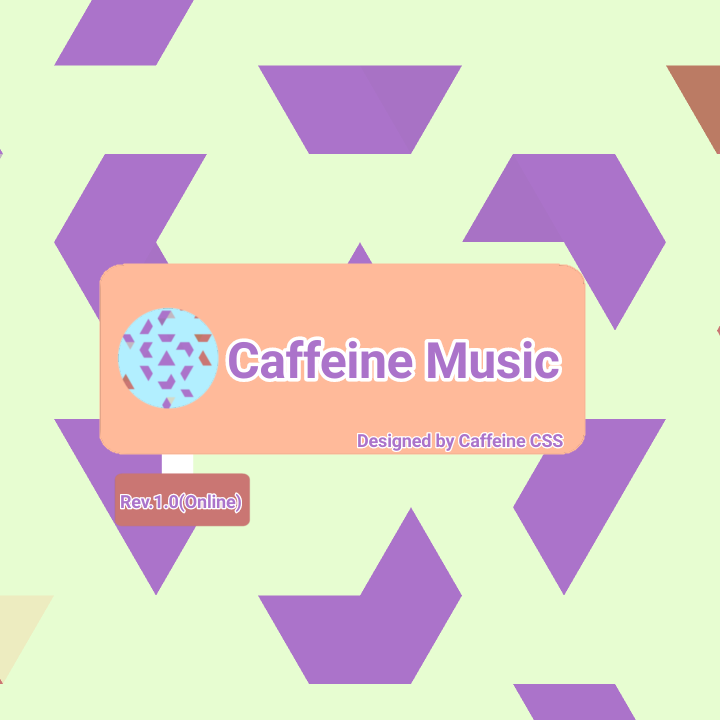
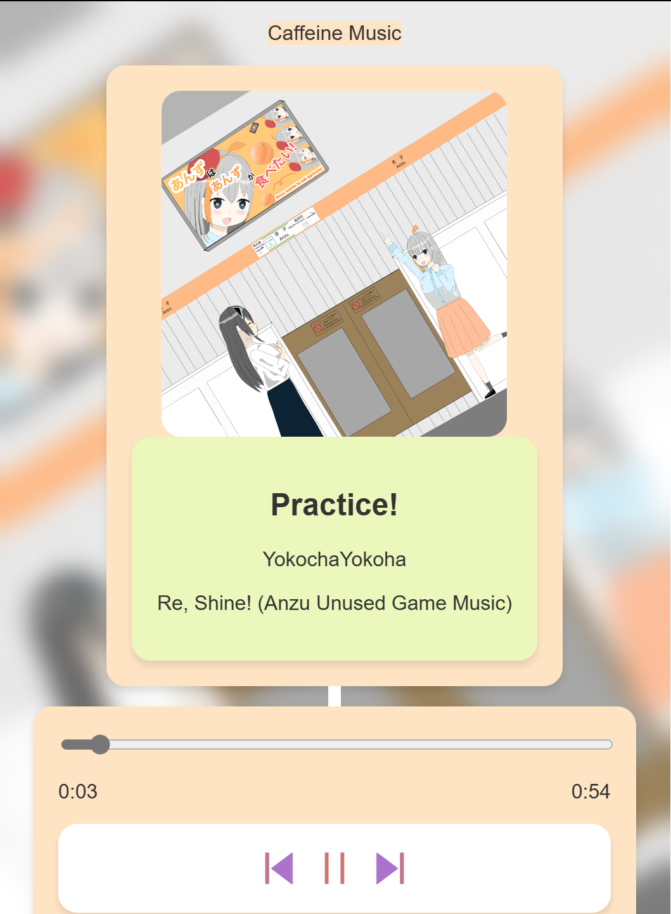
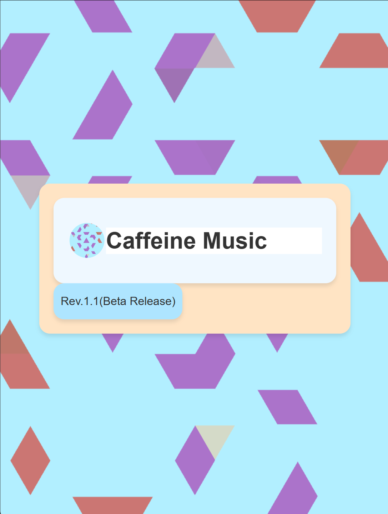

# Caffeine_Music

JP: Caffeine_CSSを活用して製作されたWebベースのオフライン音楽プレーヤーです!  
JavaScriptが正しく実行できる環境であれば動作します。  
PWAアプリケーションにも対応しています。インストールすることでオフラインでも動作します。  
Linuxを使うときに「丁寧な日本語」対応の音楽プレーヤーにあまり出会わなかったので(英語だらけだったので)、Linuxで使える「分かりやすいちゃんとした日本語表現」で書かれたモダンな音楽プレーヤーが欲しい! と思ったので製作しました! WebベースなのでOS関係なく動作します!!  
日本語版はこちらです。(JP)
https://yokochayokoha.github.io/Caffeine_Music  

EN: Web-based offline music player created by utilizing Caffeine_CSS!  
Works as long as JavaScript can be properly executed.  
PWA applications are also supported. Works offline by installing it.  

Motive(Not so important)↓  
<small> 
When I was using Linux, I didn't come across many music players with "polite Japanese" support (because they are based on English and sometimes there are translation errors), so I wanted a modern music player written in "clear and correct Japanese expressions" that I could use on Linux! So I decided to make it! It is web-based, so it works regardless of OS!  
</small>
Of course, those who are native English speakers can use this! I made an English version!(But I may make some translation mistakes...)  
English Version is here(EN) https://yokochayokoha.github.io/Caffeine_Music/en  

  

## 依存関係/Dependency  
JP: このWebアプリケーションではBSDライセンスの適用されたコンポーネント「jsmediatags」を使用させていただいています。  
権利表記やBSDライセンス条文に関してはメインの画面の下部に記載していますが、このファイルの下部にも記載しておきました。ホントに素晴らしいjsライブラリをありがとうございます!!  
リンク: https://github.com/aadsm/jsmediatags  

EN: This web application uses the BSD licensed component “jsmediatags”.  
The rights notice and BSD license is listed at the bottom of the main screen, and I have also included them in the License file. Thank you for the great and splendid js library!  
Link: https://github.com/aadsm/jsmediatags  

## スタイルシート(CSS)について/About this stylesheet(CSS)  
JP: このアプリのスタイルシートは横葉スタジオプロジェクト作成のCaffeine_CSSを使用しています。このスタイルシートは配布ページの説明に従い、ご活用ください!  
EN:  The style sheet for this application uses Caffeine_CSS created by Yokoha Studio Project.  

## 横茶横葉オリジナル部分のライセンス(mpsys.jsなど)/Yokoha parts license(mpsysen.js etc.)  
JP:横茶横葉Bライセンスです。
EN:Y.Yokoha B License

## 製作者情報/Authors  
JP: 製作: 横茶横葉  
    管理: 横茶横葉(横葉スタジオ)  
    デバッグ: 横茶横葉,Mikan  
©2024 横葉スタジオプロジェクト  
©2024 横茶横葉  
EN: Creator: Y.Yokoha  
Management: Y.Yokoha Studio Project  
Debug Assist: Mikan  
Debug: Y.Yokoha  
©2024 Y.Yokoha Studio Project  
©2024 Y.Yokoha  

jsmediatags(BSD License)  
<a href="https://github.com/aadsm/jsmediatags">https://github.com/aadsm/jsmediatags</a>  
    BSD License

    Copyright (c) 2009 Opera Software ASA
    
    Copyright (c) 2015 António Afonso
    
    Copyright (c) 2008 Jacob Seidelin, http://blog.nihilogic.dk/
    
    Copyright (c) 2010 Joshua Kifer
    
    All rights reserved.
    
    Redistribution and use in source and binary forms, with or without modification, are permitted provided that the following conditions are met:
    
    Redistributions of source code must retain the above copyright notice, this list of conditions and the following disclaimer.
    
    Redistributions in binary form must reproduce the above copyright notice, this list of conditions and the following disclaimer in the documentation and/or other materials provided with the distribution.
    
    Neither the name Facebook nor the names of its contributors may be used to endorse or promote products derived from this software without specific prior written permission.
    
    THIS SOFTWARE IS PROVIDED BY THE COPYRIGHT HOLDERS AND CONTRIBUTORS "AS IS" AND ANY EXPRESS OR IMPLIED WARRANTIES, INCLUDING, BUT NOT LIMITED TO, THE IMPLIED WARRANTIES OF MERCHANTABILITY AND FITNESS FOR A PARTICULAR PURPOSE ARE DISCLAIMED. IN NO EVENT SHALL THE COPYRIGHT HOLDER OR CONTRIBUTORS BE LIABLE FOR ANY DIRECT, INDIRECT, INCIDENTAL, SPECIAL, EXEMPLARY, OR CONSEQUENTIAL DAMAGES (INCLUDING, BUT NOT LIMITED TO, PROCUREMENT OF SUBSTITUTE GOODS OR SERVICES; LOSS OF USE, DATA, OR PROFITS; OR BUSINESS INTERRUPTION) HOWEVER CAUSED AND ON ANY THEORY OF LIABILITY, WHETHER IN CONTRACT, STRICT LIABILITY, OR TORT (INCLUDING NEGLIGENCE OR OTHERWISE) ARISING IN ANY WAY OUT OF THE USE OF THIS SOFTWARE, EVEN IF ADVISED OF THE POSSIBILITY OF SUCH DAMAGE.

